# The Mathematics of Deep Learning Optimizations- part 2

In this Section I will take a more in Depth of two of our optimizers that I laid out in my earlier writings, and begin to go thorough the mathematics of choosing a momentum, and the choosing of a Nestarov acceleration.

## Momentum

Momentum helps accelerate Gradient Descent(GD) when we have surfaces that curve more steeply in one direction than in another direction. It also dampens the oscillation as shown above.

Understanding Momentum, we begin with gradient descent-when optimizing a smooth function f, we make a small step in the gradient

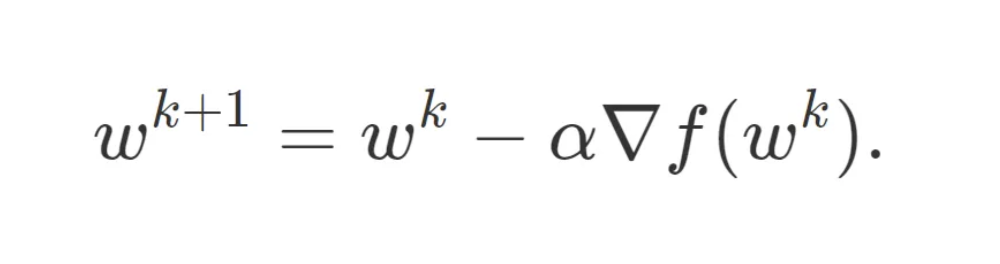

For a step-size small enough, gradient descent makes a monotonic improvement at every iteration. It always converges, albeit to a local minimum

Convergence often begins well with a sharp spiking decrease in loss, but as iterations progress, the optimisation gradient grinds to a halt as the steps towards the local minimum become progressively slower.

Where does this problem arise? Pathological curvature. Simply put, reigons of f are not always scaled in a well behaved manner: valleys, trenches, canals and ravines exist in the vector space. Gradient decent can be either jumping these valleys, or approach the optimum in tiny steps- the situation of which is far from ideal as it creates a trade-off between the validation loss and time complexity.

### Introducing Momentum

Momentum proposes the following tweak to gradient descent. We give gradient descent a short-term memory:

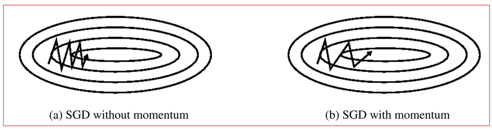

When β=0 , we recover gradient descent. But for β=0.99, this appears to be the boost we need. Momentum allows G.D to regain its convergence pacing. We call this process "acceleration".

Momentum gives up to a quadratic speedup on many functions, similar to the speedup you get from the Fast Fourier Transform, Quicksort, and Grover's Algorithm.

A lower bound, courtesy of Nesterov, states that momentum is, in a certain very narrow and technical sense, optimal. Now, this doesn't mean it is the best algorithm for all functions in all circumstances, but it can allow for some impressive mathematical optimisation that will be examined below.

### First Steps: Gradient Descent

We begin by studying gradient descent on the simplest non trivial model-the convex quadratic:

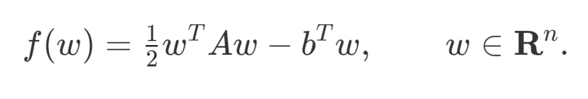

Assume A is symmetric and invertible, then the optimal solution w* occurs at:

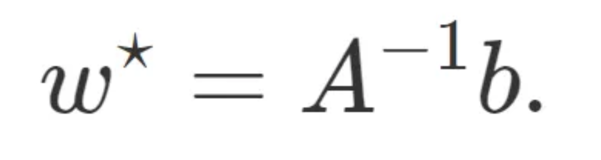

There is a very natural space to view gradient descent where all the dimensions act independently — the eigenvectors of A.

Every symmetric matrix A has an eigenvalue decomposition

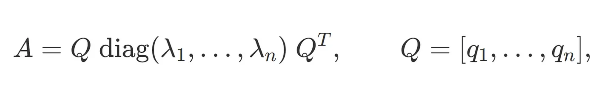

and, as per convention, we will assume that the λ​i​​'s are sorted, from smallest λ​1​​ to biggest λ​n​​.

If we perform a change of basis, x^{k} = Q^T(w^{k} — w^*)
the iterations break apart, becoming:

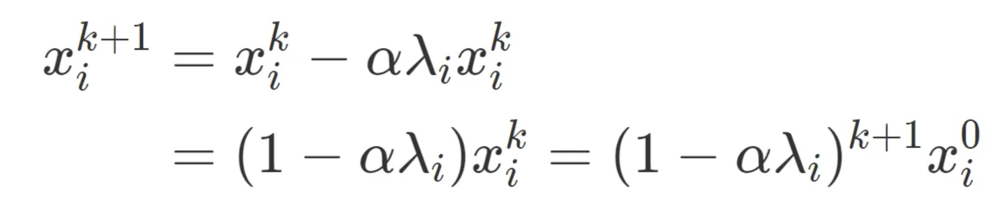

​​​​Moving back to our original space w, we can see that

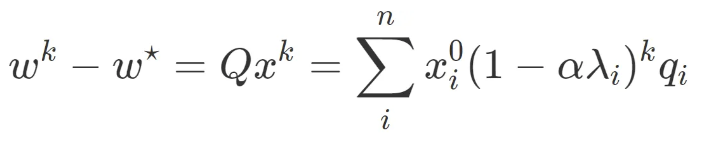

​​and there we have it — gradient descent in closed form.

### Decomposing the Error

The above equation admits a simple interpretation. Each element of x⁰​ is the component of the error in the initial guess in the Q-basis. There are n such errors, and each of these errors follows its own, solitary path to the minimum, decreasing exponentially with a compounding rate of 1−αλ​i​​. The closer that number is to 1, the slower it converges.

By writing the contributions of each eigenspace's error to the loss:

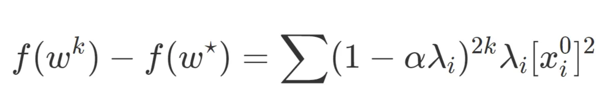

We can consider the decreasing rate of optimisation for gradient decent.

### The Dynamics of Momentum

Returning back the concept of momentum, recall that the momentum update is:

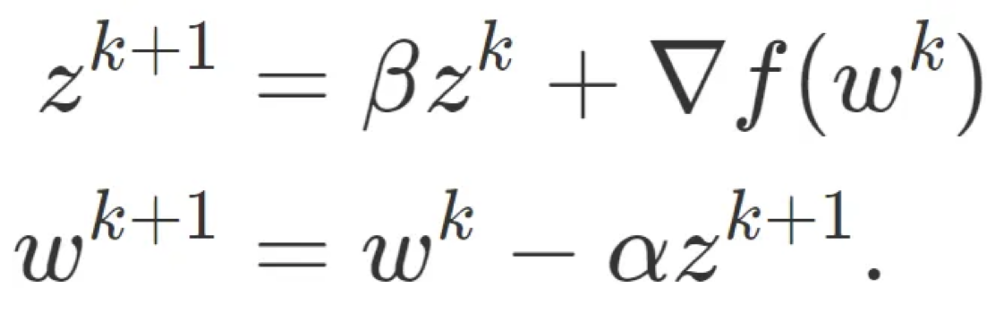

Since ∇f(w^k) = Aw^k -b, the update on the quadratic is:

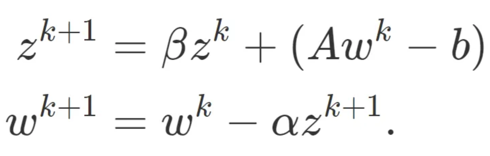

with the change of basis x^{k} = Q(w^{k} and y^{k} = Q*z^{k}, we can yield the update rule:

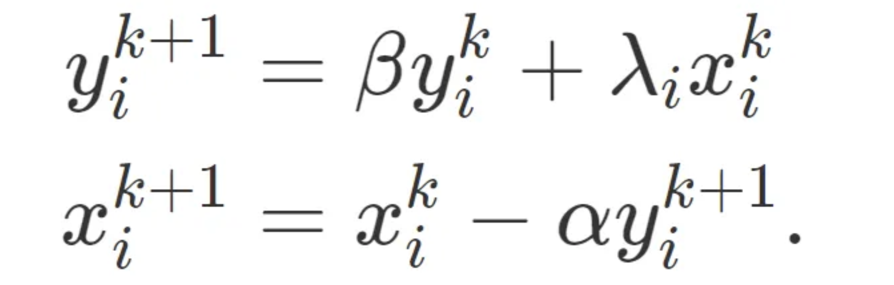

in which each component acts independently of the other components (though x:ki​​ and y:ki​​ are coupled). This lets us rewrite our iterates as

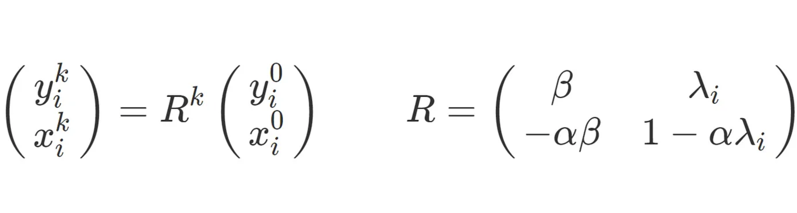

There are many ways of taking a matrix to the k^{th} power. But for the 2×2 case there is an elegant and little known formula in terms of the eigenvalues of R, σ​1​​ and σ​2​​.

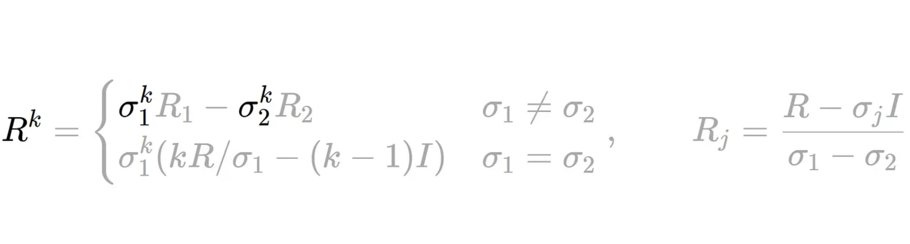

This formula is rather complicated, but the takeaway here is that it plays the exact same role the individual convergence rates, 1−αλ​i​​ do in gradient descent. But instead of one geometric series, we have two coupled series, which may have real or complex values. The convergence rate is therefore the slowest of the two rates, max{∣σ​1​​∣,∣σ​2​​∣}^4. By plotting this out, we see there are distinct regions of the parameter space which reveal a rich taxonomy of convergence behaviour :

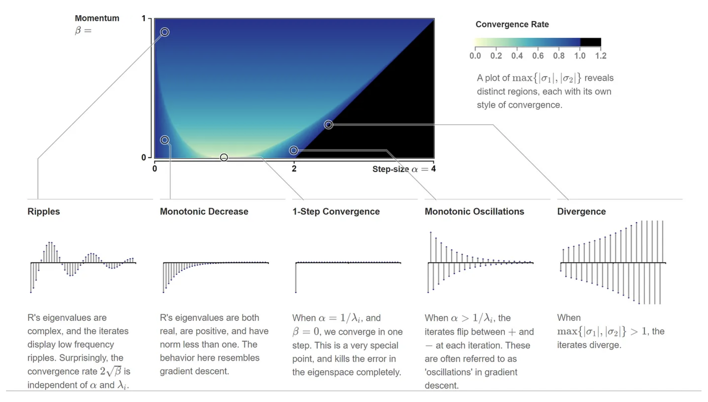

For what values of α and β does momentum converge? Since we need both σ​1​​ and σ​2​​ to converge, our convergence criterion is now: max{∣σ​1​​∣,∣σ​2​​∣}<1. The range of available step-sizes work out to be:

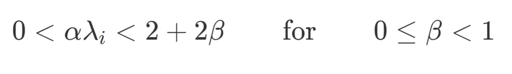

### Example: The Colorization Problem

Lets apply this analysis to a real world example.

Let's look at how momentum accelerates convergence with a concrete example. On a grid of pixels let G be the graph with vertices as pixels, E be the set of edges connecting each pixel to its four neighbouring pixels, and D be a small set of a few distinguished vertices. Consider the problem of minimizing

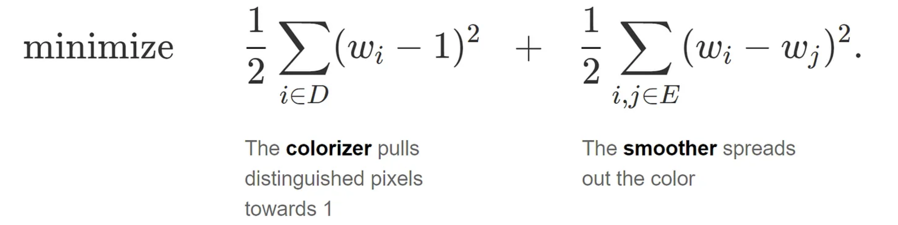

The optimal solution to this problem is a vector of all 1's . An inspection of the gradient iteration reveals why we take a long time to get there. The gradient step, for each component, is some form of weighted average of the current value and its neighbours:

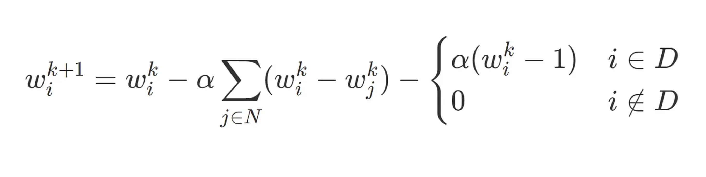

This kind of local averaging is effective at smoothing out local variations in the pixels, but poor at taking advantage of global structure. Movement towards equilibrium is made only through local corrections and thus its convergence is laborious. Fortunately, momentum speeds things up significantly.

In vectorized form, the colorization problem is

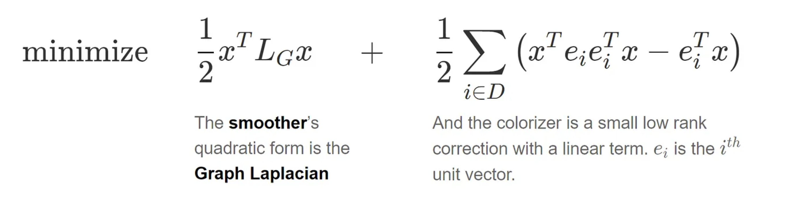

The Laplacian matrix, L​G​ 8, which dominates the behaviour of the optimization problem, is a valuable bridge between linear algebra and graph theory. The conditioning L​G​​, here is defined as the ratio of the second eigenvector to the last (the first eigenvalue is always 0, with eigenvectors equal to the matrix of all 1's), is directly connected to the connectivity of the graph.

Well connected graphs allow rapid diffusion of information through the edges, while graphs with poor connectivity do not. And this principle, taken to the extreme, furnishes a class of functions so hard to optimize they reveal the limits of first order optimizations such as momentum, nestarovian momentum and Adam.

## Nesterov Momentum

Nesterov accelerated gradient (NAG) momentum is a simple change to normal momentum. Here the gradient term is not computed from the current position θt in parameter space but instead from a position θt+μvt(intermediate)=θt+μvt. This helps because while the gradient term always points in direction when loss is minimised, the momentum term may not. If the momentum term points in the wrong direction or overshoots, the gradient can still "go back" and correct it in the same update step.

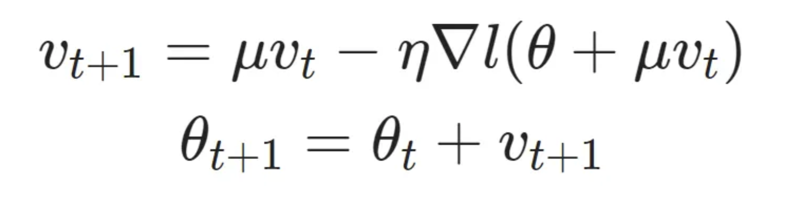

The hard part is actually finding the correct learning rate and momentum value in order to get the convergence guarantees that make the method attractive. Sutskever in his thesis suggests manual tuning to get an optimal result (at least for deep learning applications).

Sutskever Nesterov Momentum and Bengio Nesterov Momentum are variation upon this basic Momentum function. The key idea behind the Sutskever momentum derivation is to shift the perspective about which of the parameters we want as the result of the iteration, from y to θ.

The Bengio formulation of Nesterov momentum starts from the Sutskever definition and then defines a new variable, Θ, which represents θ after a momentum update. More can be found [here](https://jlmelville.github.io/mize/nesterov.html).

## References:

This article could not have been written without the sources below that contain the mathematical derivations of the functions considered, and the diagrams used for illustration.

- Goh, "Why Momentum Really Works", Distil, 2017
- Nesterov Accelerated Gradient and Momentum, James Melville, 2016
- Overview of different Optimizers, Towards Data Science, 2015
- Optimisers Explained, 2018

Don't forget to give us your 👏 !